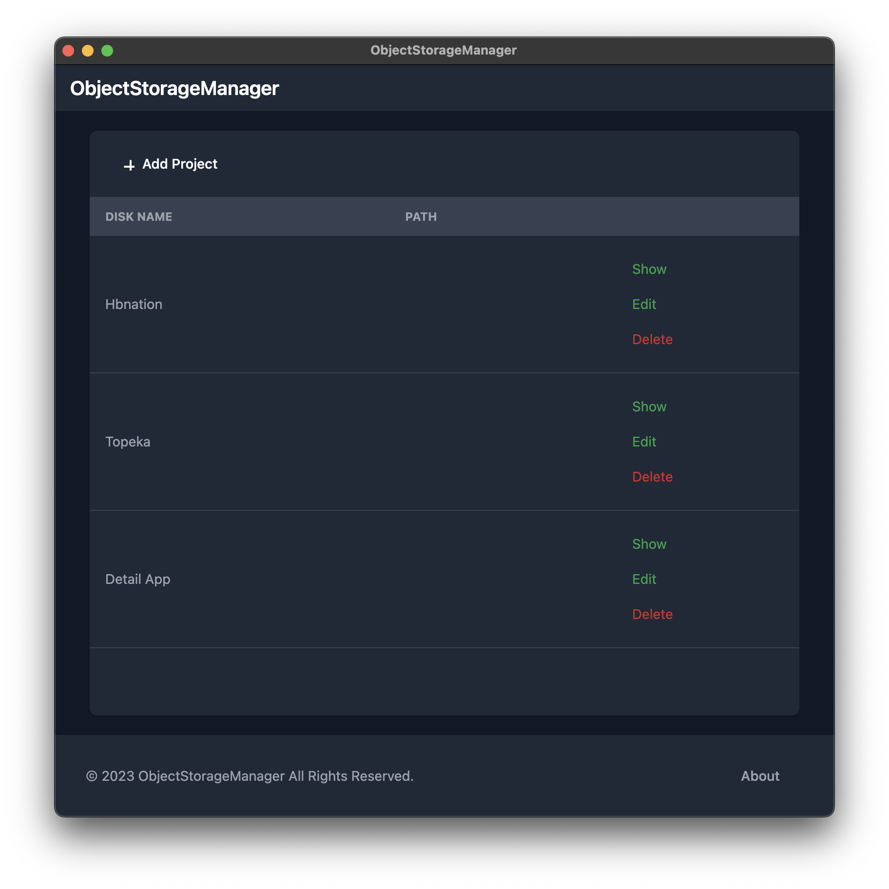
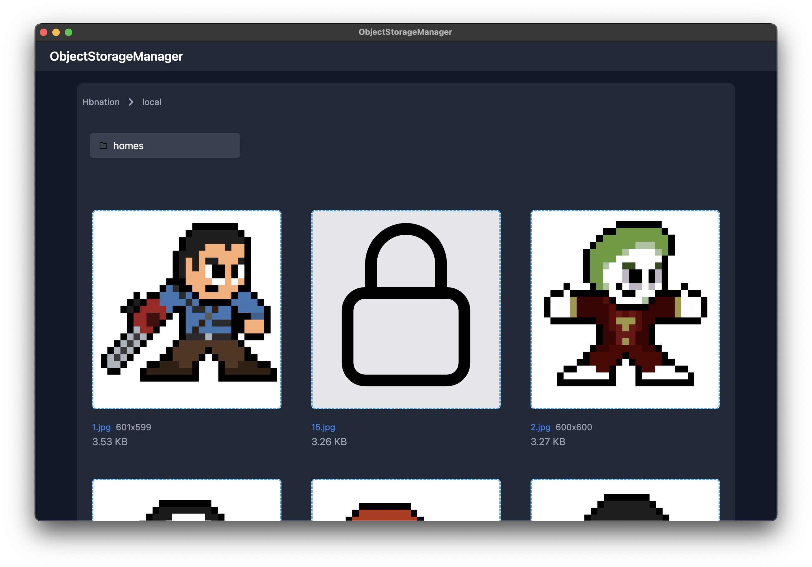
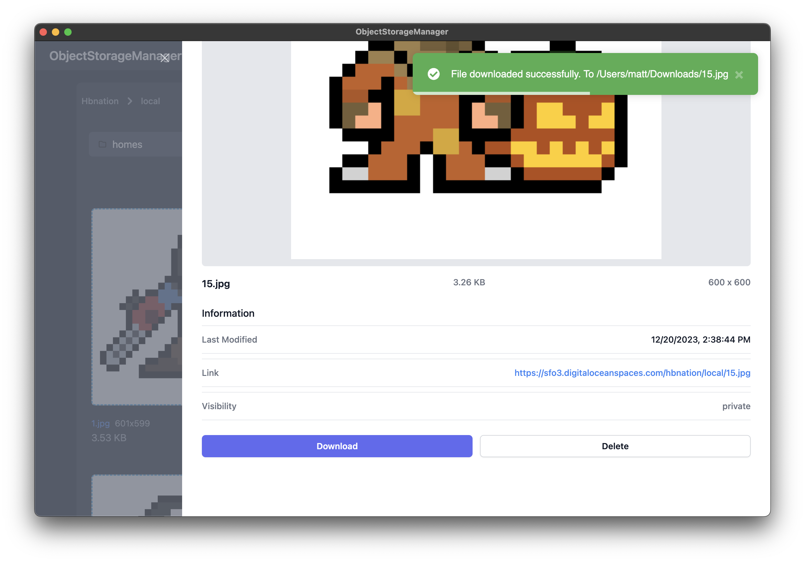

# Object Storage Manager

## Images

## Development Installation
1. Clone the repo
2. Run `cp .env.example .env`
3. Run `composer install`
4. Run `npm install`
5. Run `npm run dev`
6. Run `php artisan key:generate`
7. Run `php artisan native:serve`

